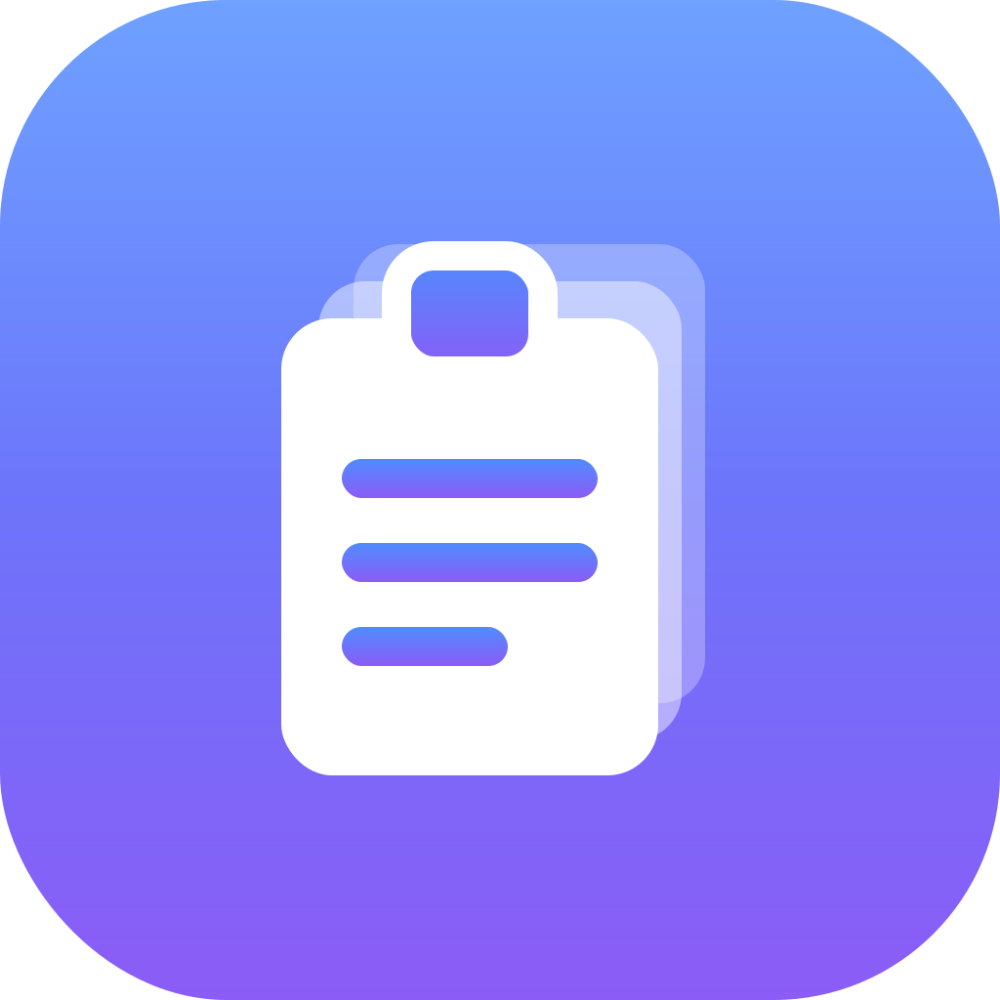

  
  <h1>ClipCrate</h1>
  
<strong>The developer's smart clipboard for Windows.</strong>

  
Copy once, find it instantly, and never leak a secret again.

  

    <a href="https://justtapp.github.io/ClipCrate-releases/"><b>Website</b></a> ·
    <a href="https://github.com/JusttApp/ClipCrate-releases/releases/latest"><b>Download</b></a>
  

---

## ⬇️ Download

Grab the latest from [**Releases**](https://github.com/JusttApp/ClipCrate-releases/releases/latest):

- **`ClipCrate_x.y.z_x64-setup.exe`** — recommended (smaller installer)
- **`ClipCrate_x.y.z_x64_en-US.msi`** — MSI alternative

> The installer isn't code-signed yet, so Windows SmartScreen may show
> *"Windows protected your PC."* Click **More info → Run anyway**. The app
> auto-updates itself after that.

## What it does

Press **`Alt+V`** for a fast, Spotlight-style overlay — search your clipboard
history and paste straight back into whatever app you were in. But it's more
than a history list:

- **🔒 Privacy Shield** — detects secrets you copy (AWS keys, GitHub/Stripe
  tokens, JWTs, `.env` files, card numbers) and **blurs them** in the list
  until you hover. Optionally auto-deletes them after a delay.
- **✨ Smart Paste** — knows which app you're pasting into. Copy ugly JSON,
  `Alt+V` over Slack, hit `Tab` → it pastes as a clean code block.
- **🏷️ Content detection** — JSON, URLs, code, SQL, emails and colors are
  auto-tagged with a badge.
- **🛠️ Smart Actions** — format JSON, strip URL tracking, decode JWTs, extract
  emails, Base64, and more — plus **Custom JavaScript actions** you write.
- **🖼️ Images & files, pins, collections** — capture screenshots and files,
  pin favorites, and organize into collections.
- **🖥️ Local-first** — everything lives in a SQLite database on your machine.
  No account, no cloud, no telemetry. ~3 MB. Runs quietly in your system tray.

## Free vs. Pro

| | Free | Pro |
|---|---|---|
| Clipboard history | Last 100 clips | **Unlimited** |
| Search · badges · Privacy Shield | ✓ | ✓ |
| Smart Actions | 3 | **All** |
| Custom JavaScript actions | — | ✓ |
| Images, files, pins & collections | — | ✓ |

**Pro is a one-time purchase — no subscription.**
[Get Pro →](https://justtapp.github.io/ClipCrate-releases/#pricing)

## Usage

| Action | Key |
|---|---|
| Open / close overlay | `Alt+V` |
| Navigate | `↑` / `↓` |
| Paste | `Enter` |
| Smart Paste | `Tab` |
| Close | `Esc` |

---

This repository hosts ClipCrate's downloads and website. The app is built
with <a href="https://tauri.app">Tauri</a> (Rust + React). © JusttApp.
